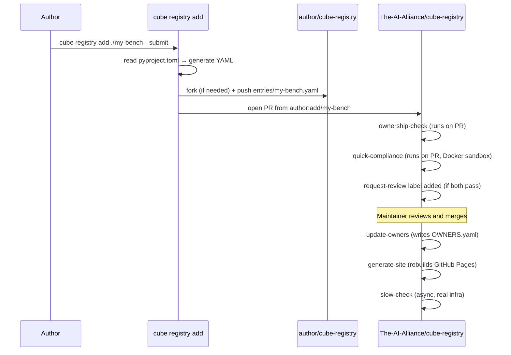
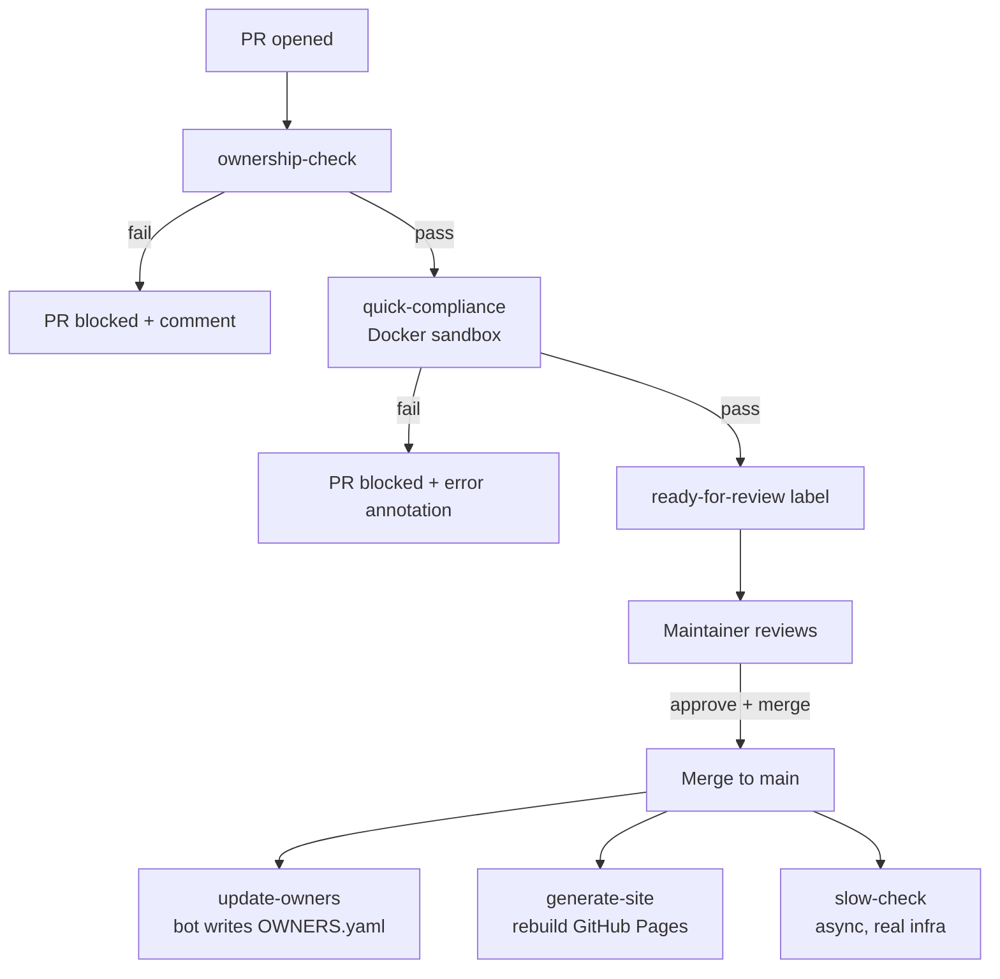

# CUBE Registry — Design Specification

The CUBE Registry is a public GitHub repository of metadata entries for CUBE-compliant
benchmarks. It does not host code or data — it indexes metadata and points to PyPI packages.

**Core principles:**
- Authors submit a YAML file. CI does the rest.
- Fields derivable from the CUBE Python API are derived automatically; authors only provide
  what code can't tell us.
- Ownership is enforced by CI, not by human reviewers.
- A maintainer reviews before merge (no auto-merge), but CI does all the work of verifying.

---

## Repository layout

```
cube-registry/
├── entries/               # one file per benchmark, globally unique IDs
│   ├── osworld.yaml
│   └── webarena.yaml
├── stress-results/        # written by CI only
│   └── osworld/v1.2.0.json
├── OWNERS.yaml            # maps id → github handles; maintained by CI bot after merge
├── known-authors.yaml     # manually curated: original paper authors by benchmark id
├── registry-schema.json
├── scripts/
│   ├── ownership_check.py
│   ├── quick_check.py
│   ├── slow_check.py
│   ├── health_check.py
│   └── update_owners.py
├── site-src/              # static site generator (Jinja2 → GitHub Pages)
│   └── generate.py
├── docs/                  # generated by CI, never edited by hand
└── .github/workflows/
    ├── quick-check.yml
    ├── slow-check.yml
    ├── update-owners.yml
    ├── periodic-health-check.yml
    └── generate-site.yml
```

---

## Submission flow



### `cube registry add`

The CLI command in `cube-standard` handles the submission workflow:

1. Reads `pyproject.toml` to extract `id`, `version`, `package`, `dev_install_url`, `authors`, `license`.
2. Writes `cube-registry-entry.yaml` in the benchmark directory with author-provided fields and `<TODO:>` markers for anything it can't auto-detect.
3. With `--submit`: validates no TODOs remain, forks `The-AI-Alliance/cube-registry` (or a custom `--registry` target), pushes the entry, and opens a PR.

---

## CI pipeline

### Ownership check (fast, every PR)

Reads `OWNERS.yaml` from `origin/main` (never from the PR branch — prevents self-granting).

| Situation | Result |
|-----------|--------|
| New entry (no key in OWNERS.yaml) | ✅ pass — open submission |
| Author modifying their own entry | ✅ pass |
| Stranger modifying someone else's entry | ❌ blocked |
| PR touches `OWNERS.yaml` or `stress-results/` directly | ❌ blocked |

### Quick compliance (Docker sandbox, every PR, ~2 min)

Runs inside a Docker container with no cloud credentials:

1. Validate YAML against `registry-schema.json` (package name format, `dev_install_url` domain allowlist, required fields).
2. `pip install <package>==<version>` (falls back to `dev_install_url` if not yet on PyPI).
3. Import the package; resolve the `Benchmark` class via `cube.benchmarks` entry point or by name.
4. Instantiate `Benchmark()`, call `get_task_configs()` → derive `task_count`.
5. Introspect `benchmark.resources` → derive `resources` list.
6. Inspect `Task` class for feature flags (`async`, `streaming`, `multi_agent`).
7. Write CI-derived fields back to the YAML.

If all pass: PR is labelled `ready-for-review` and a comment is posted. A maintainer then
reviews and merges. No auto-merge — a human approves before anything lands on `main`.

### Slow compliance (real infra, post-merge, async)

Triggered after merge, and re-triggered when `version`, `package`, `supported_infra`, or
any `image_url` changes (not for tag/description/legal edits).

For each provider in `supported_infra`:
- Provision infra from `benchmark.resources` (Docker: run on runner; VM: ephemeral cloud spot).
- Run a full debug episode via `make_debug_agent()`.
- Capture profiling metrics (setup time, step latency p50/p95, episode time).
- Write results to `stress-results/<id>/v<version>.json`.

On failure: open a GitHub issue tagging the owners. Entry stays in the registry — platforms
can filter on slow-check status.

Cost: Docker checks are free. VM checks ~$0.04–0.06/run (spot, ephemeral).

### Periodic health check (weekly)

Checks every entry for decay:
- `pip install <package>` still works.
- All URLs in `resources[].image_url` return HTTP 200.

On failure: set `status: degraded`, open/update a GitHub issue for the owners.

---

## Access control



**Security boundaries:**
- Quick-compliance job has **no cloud credentials** — safe to run untrusted PyPI packages.
- Package install and import run inside Docker with `--cap-drop NET_ADMIN,SYS_PTRACE,SYS_ADMIN --security-opt no-new-privileges --pids-limit 512`.
- Slow-check runner has cloud credentials but **never imports the benchmark package** — the package runs inside the provisioned VM.
- `OWNERS.yaml` is written only by the CI bot via a path-restricted bypass rule; direct pushes from humans are blocked.
- PR author GitHub handle is validated against `^[a-zA-Z0-9][a-zA-Z0-9-]{0,37}$` before use.
- Package name validated against PyPI normalised naming before passing to `pip` or `importlib`.
- YAML round-trip integrity checked: `id`, `package`, `version` must survive load/dump unchanged (guards against anchor/alias injection).

---

## Registry entry schema

Fields split by who sets them:

**Author-provided** (in the PR):

| Field | Required | Notes |
|-------|----------|-------|
| `id` | ✅ | Unique slug matching the filename (`osworld`, `webarena-lite`) |
| `name` | ✅ | Human-readable display name |
| `version` | ✅ | Must match the PyPI package version exactly |
| `description` | ✅ | One-paragraph summary |
| `package` | ✅ | PyPI package name |
| `dev_install_url` | — | `git+https://github.com/...` for pre-PyPI packages |
| `authors[].github` | ✅ | GitHub handle — populates `OWNERS.yaml` on merge |
| `authors[].name` | — | Display name |
| `legal.wrapper_license` | ✅ | SPDX id for the cube wrapper code |
| `legal.benchmark_license.reported` | — | SPDX id as reported by the cube developer (unverified) |
| `legal.benchmark_license.source_url` | — | Link to the upstream license — health-checked |
| `legal.notices[]` | — | Structured notices: `third_party_data`, `software_registration`, `live_website_clone`, `attribution` |
| `tags` | — | `web`, `coding`, `os`, `gui`, `mobile`, `science`, `math`, `multi-agent` |
| `paper` | — | arXiv or venue URL |
| `getting_started_url` | — | Docs or quick-start |
| `supported_infra` | — | `aws`, `azure`, `gcp`, `local`. Defaults to `[aws]` |
| `max_concurrent_tasks` | — | Hint for parallel task cap |
| `parallelization_mode` | — | `sequential \| task-parallel \| benchmark-parallel` |

**CI-derived** (written by quick or slow check — do not edit):

| Field | Set by | Notes |
|-------|--------|-------|
| `status` | health-check | `active \| degraded \| archived` |
| `task_count` | quick-check | From `benchmark.get_task_configs()` |
| `has_debug_task` | quick-check | Required `true` for slow check to run |
| `has_debug_agent` | quick-check | From `make_debug_agent()` presence |
| `resources` | quick-check | Serialized `ResourceConfig` objects from `benchmark.resources` |
| `action_space` | quick-check | Tool names from a reset task |
| `features.*` | quick-check | `async`, `streaming`, `multi_agent`, `multi_dim_reward` |
| `legal.benchmark_license.verified_by_original_authors` | quick-check | `true` if submitter is in `known-authors.yaml` |
| `stress_results_url` | slow-check | Path to latest profiling results JSON |

---

## Static site (GitHub Pages)

`site-src/generate.py` reads `entries/*.yaml` and renders Jinja2 templates into `docs/`.
GitHub Pages serves `docs/` — zero hosting cost.

**Index page:** card grid with name, description, status badge, tags, task count, install command.
**Per-benchmark page:** full metadata, resources table, feature flags, legal section, stress results, copy button for `pip install`.

---

## Example entry

```yaml
# entries/osworld.yaml
id: osworld
name: OSWorld
version: "1.2.0"
description: >
  Benchmarks multimodal agents on real Ubuntu desktop tasks spanning file
  management, web browsing, coding, and GUI interaction.
package: osworld-cube
dev_install_url: "git+https://github.com/xlangai/osworld-cube"

authors:
  - github: author-a
    name: Author A

legal:
  wrapper_license: MIT
  benchmark_license:
    reported: "CC-BY-4.0"
    source_url: "https://github.com/xlangai/osworld/blob/main/LICENSE"
  notices:
    - type: software_registration
      description: "Ubuntu desktop with pre-installed commercial applications"

paper: "https://arxiv.org/abs/2404.07972"
tags: [os, gui, desktop]
supported_infra: [aws, azure]

# Fields below are set by CI — do not edit manually.
status: active
task_count: 369
has_debug_task: true
has_debug_agent: true
resources:
  - type: VMResourceConfig
    image_url: "https://huggingface.co/datasets/xlangai/osworld/resolve/main/ubuntu.qcow2"
    ram_gb: 16
    disk_gb: 40
features:
  async: false
  streaming: false
  multi_agent: false
  multi_dim_reward: false
stress_results_url: "stress-results/osworld/v1.2.0.json"
```
